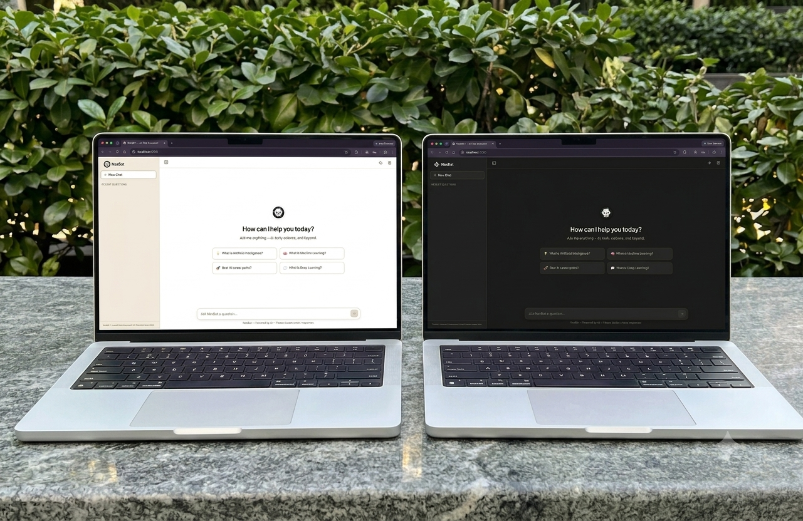

<div align="center">
  
# 🤖 NexBot
**Your Intelligent AI Assistant**


[<kbd> <br> Live Demo <br> </kbd>](#)

<br><br>



</div>

<br>

## 📖 About NexBot
NexBot is a highly responsive, modern AI FAQ assistant built as part of the CodeAlpha AI Internship 2026. It combines a beautiful, sleek "Soft Cream" and Dark Mode UI with a custom-built TF-IDF search engine for fast, local FAQ responses. When a question goes beyond the built-in knowledge base, it seamlessly falls back to a powerful NVIDIA LLM (`minimaxai/minimax-m3`) via an Express.js backend API, delivering highly accurate, streaming responses.

---

## ✨ Features
✅ **SaaS-Grade UI/UX:** Clean, premium design featuring a modern sidebar, hover effects, and crisp typography (`Plus Jakarta Sans`).  
✅ **Dark & Light Mode:** Fully persistent theme toggling using CSS variables and `data-theme`.  
✅ **Hybrid Search Engine:** Custom `TF-IDF` natural language processing algorithm for instant FAQ matching, falling back to an LLM.  
✅ **Smart AI Typing Effect:** Fluid, animated text streaming that mimics human-like typing speeds.  
✅ **Session Persistence:** True chat history retention across page reloads and tab switching using HTML5 `sessionStorage`.  
✅ **Markdown Support:** Full GitHub Flavored Markdown parsing for rich text, code blocks, and formatting.  
✅ **Fully Responsive:** Perfectly optimized for all screen sizes, from ultra-wide desktops to small smartphones with an animated slide-in sidebar.  

---

## 🛠️ Tech Stack
**Frontend:**
- HTML5 (Semantic Structure)
- CSS3 (Vanilla CSS, Custom Properties, Media Queries, CSS Grid/Flexbox)
- Vanilla JavaScript (ES6+, DOM Manipulation)
- `marked.js` (Markdown parsing)

**Backend:**
- Node.js
- Express.js
- Axios (for API requests)
- CORS

---

## 🚀 How to Run

1. Clone the repository:
```bash
git clone https://github.com/poovarasu638178-rgb/CodeAlpha_NexBot.git
```

2. Navigate into the project directory:
```bash
cd CodeAlpha_NexBot
```

3. Install the dependencies:
```bash
npm install
```

4. Start the backend server:
```bash
node server.js
```

5. Open your browser and visit:
```text
http://localhost:3000
```

---

## 📂 Project Structure

```text
CodeAlpha_NexBot/
├── index.html       # The main chat interface
├── style.css        # Extensive styling, theming, and responsive layouts
├── script.js        # Frontend logic: TF-IDF engine, API handling, SessionStorage, UI interactions
├── server.js        # Express.js backend serving static files and proxying the NVIDIA API
├── package.json     # Node.js dependencies (express, cors, axios)
└── favicon.png      # NexBot Logo/Avatar
```

---

## 🧠 AI Integration
NexBot uses a sophisticated fallback mechanism for its intelligence:
1. **Local TF-IDF Search:** It first processes user input locally using a custom Term Frequency-Inverse Document Frequency algorithm to score similarity against known FAQs, saving API calls and ensuring instant responses.
2. **NVIDIA API (minimaxai/minimax-m3):** If no local match is found, the Express backend securely proxies the request to the NVIDIA API, querying the advanced `minimax-m3` model with custom system prompts to ensure the AI behaves strictly as NexBot.

---

## 👨‍💻 Author

Built by **Poovarasu S**  
- **GitHub:** [poovarasu638178-rgb](https://github.com/poovarasu638178-rgb)
- **Internship:** CodeAlpha AI Internship 2026
- **Student ID:** CA/DF1/126353

---

## 🌐 Manual Deployment (Vercel)

NexBot can be easily deployed to Vercel as a hybrid application (Static Frontend + Serverless Backend).

1. Install **Vercel CLI** globally (if not already installed):
   ```bash
   npm install -g vercel
   ```

2. Run the deployment command in the root folder:
   ```bash
   vercel
   ```
   *Follow the CLI prompts to link the project and deploy it.*

3. Set your environment variables on the Vercel Dashboard:
   - Go to your Project settings -> **Environment Variables**.
   - Add a new environment variable: `NVIDIA_API_KEY` and set it to your NVIDIA API Key.

4. Deploy to production:
   ```bash
   vercel --prod
   ```

---

## 📄 License
This project is licensed under the **MIT License**. You are free to use, modify, and distribute this software.

---

### ⭐ Star this repo if you found it helpful!
