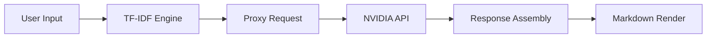

# NexBot — AI Chatbot

Your intelligent AI companion, always ready to help.


**Live Demo:** [https://nexbott.vercel.app/](https://nexbott.vercel.app/)

---

## About

NexBot is a fast, secure Claude-style AI chatbot. It uses a Node.js proxy to connect the frontend directly to the powerful `minimaxai/minimax-m3` model via NVIDIA NIM. Built for elegance and speed, NexBot acts as your intelligent companion for clear, concise answers.

## Features

- ✅ **Real-Time Chat**: Engage in seamless conversations with near-instant API responses.
- ✅ **Context-Aware**: The engine understands ongoing context to provide highly accurate answers.
- ✅ **Clean UI**: A stunning, compact single-viewport design inspired by top-tier chat interfaces.
- ✅ **Dark Mode**: Instantly toggle between a beautiful Soft Cream light theme and a sleek dark mode.
- ✅ **Responsive Design**: Scales flawlessly across mobile, tablet, and desktop devices.
- ✅ **Secure Architecture**: API keys remain completely hidden via server-side proxy management.

## ⚙️ How It Works



1. **User Input**: The client submits text, instantly locking the UI and injecting a typing indicator into the DOM.
2. **TF-IDF Engine**: A local vectorization algorithm calculates cosine similarity to check queries against a hardcoded FAQ dataset.
3. **Proxy Request**: If the similarity score falls below the threshold, the client executes an asynchronous fetch to the Node.js backend.
4. **NVIDIA API**: The Express server intercepts the request, injects the secure API key, and forwards the payload to the Minimax model.
5. **Response Assembly**: The proxy receives the generated completion and returns it to the client as JSON.
6. **Markdown Render**: The frontend parses the raw text via marked.js and sequentially updates the DOM to simulate natural typing.

**API Key Security (Why a Proxy?)**
Exposing the NVIDIA API key to the client's browser is dangerous. Instead, the frontend sends requests to the local Node.js backend (`server.js`). This backend securely attaches the private API key and queries the NVIDIA NIM endpoint (`https://integrate.api.nvidia.com/v1/chat/completions`). This architecture keeps your credentials completely secure from malicious actors.

## Tech Stack

- **Frontend**: HTML5, CSS3 (Vanilla), JavaScript (Vanilla ES6+)
- **Backend Proxy**: Node.js, Express
- **API Integration**: Axios, NVIDIA API (`minimaxai/minimax-m3`)
- **Other**: Markdown Parsing (`marked.js`), Environment Configuration (`dotenv`), CORS (`cors`)
- **Deployment**: Vercel (`vercel.json`, `api/chat.js`)

## How to Run

1. **Clone the repository:**
   ```bash
   git clone https://github.com/poovarasu638178-rgb/codealpha_tasks.git
   cd codealpha_tasks/Task2_NexBot
   ```

2. **Install dependencies:**
   ```bash
   npm install
   ```

3. **Set up environment variables:**
   Create a `.env` file in the root directory and add your NVIDIA API key:
   ```env
   NVIDIA_API_KEY=your_api_key_here
   ```

4. **Start the server:**
   ```bash
   npm start
   ```

5. **Open in browser:**
   Navigate to [http://localhost:3000](http://localhost:3000)

## Project Structure

```text
├── .env                  # Environment variables (API Key)
├── .gitignore            # Git ignored files
├── index.html            # Main Chat Interface (Frontend)
├── style.css             # UI Styling (Light/Dark mode)
├── script.js             # Client-side Logic (Chat handling)
├── server.js             # Node.js Proxy Server
├── package.json          # Project dependencies & scripts
├── package-lock.json     # Dependency lockfile
├── vercel.json           # Vercel deployment configuration
├── api/                  # Vercel Serverless Functions
│   └── chat.js           # Serverless endpoint for Vercel
├── favicon.png           # NexBot Logo/Icon
├── preview.png           # Demo Preview image
└── test_nvidia.js        # Script to test NVIDIA API connection
```

## Author

Built by **Poovarasu S**
- **GitHub:** [poovarasu638178-rgb](https://github.com/poovarasu638178-rgb)
- **Internship:** CodeAlpha AI Internship 2026
- **Student ID:** CA/DF1/126353

## License

This project is licensed under the MIT License.

---
⭐ **If you like this project, please consider giving it a star on GitHub!**
